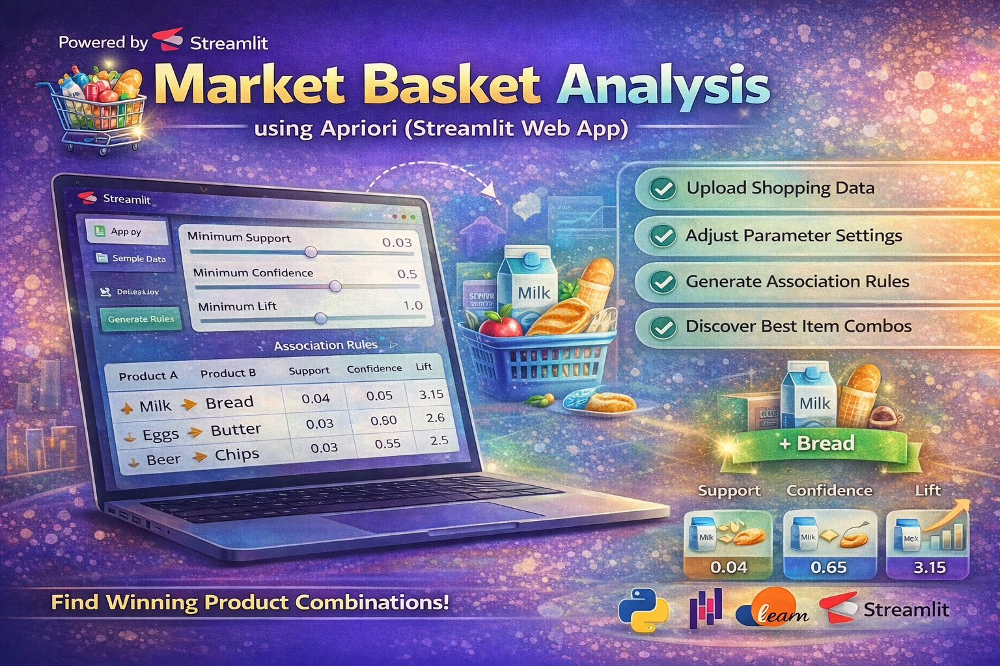

<p align="center">
  
</p>

# 🛒 Market Basket Analysis using Apriori (Streamlit Web App)

## 📌 Project Overview

This project implements **Market Basket Analysis** using the **Apriori Algorithm** to discover relationships between products frequently purchased together.

An interactive **Streamlit Web Application** is developed to allow users to upload datasets, adjust parameters, and generate association rules in real-time.

---

## 🚀 Features

* 📂 Upload your own transaction dataset (CSV)
* ⚙️ Adjustable parameters:

  * Minimum Support
  * Minimum Confidence
  * Minimum Lift
* 📊 Automatic association rule generation
* 📈 Sorted results based on Lift (strongest rules first)
* 🔥 Highlights best product combination
* 🎯 Clean and interactive UI using Streamlit

---

## 🧠 What is Market Basket Analysis?

Market Basket Analysis is a data mining technique used to identify **associations between products** in customer transactions.

### Example:

If a customer buys **Milk**, they are likely to also buy **Bread**.

---

## ⚙️ Algorithm Used: Apriori

The **Apriori Algorithm** is used to find frequent itemsets and generate association rules.

### Key Metrics:

* **Support** → Frequency of item combinations
* **Confidence** → Likelihood of buying item B when item A is purchased
* **Lift** → Strength of association between items

---

## 🏗️ Project Structure

```
Market_Basket_Analysis/
│
├── app.py                # Streamlit Web App
├── dataset.csv          # Sample Dataset
├── requirements.txt     # Dependencies
└── README.md            # Project Documentation
```

---

## 🛠️ Installation

### 1️⃣ Clone the Repository

```
git clone https://github.com/selvan-01/Market_Basket_Analysis_using_APIRIORI.git
cd market-basket-analysis
```

### 2️⃣ Install Dependencies

```
pip install -r requirements.txt
```

### 3️⃣ Run the App

```
streamlit run app.py
```

---

## 📊 Sample Output

The app generates rules like:

| Product A | Product B | Support | Confidence | Lift |
| --------- | --------- | ------- | ---------- | ---- |
| Milk      | Bread     | 0.04    | 0.65       | 3.2  |

---

## 🏪 Real-World Applications

* 🛒 Supermarkets (product placement)
* 🛍️ E-commerce recommendations
* 📦 Inventory management
* 🎯 Cross-selling strategies

---


---

## 👨‍💻 Author

**Senthamil Selvan**

## 🔗 Links

- 💼 [LinkedIn](https://www.linkedin.com/in/senthamil45)
- 🌍 [Portfolio](https://senthamill.vercel.app/)
- 💻 [GitHub](https://github.com/selvan-01/Market_Basket_Analysis_using_APIRIORI.git)

---

## ⭐ Support

If you like this project, give it a ⭐ on GitHub!

---

## 📢 Future Improvements

* Add data visualization (charts & graphs)
* Deploy on cloud (Streamlit Cloud / Render)
* Add multi-item recommendations
* Improve UI with advanced styling

---

## 🏁 Conclusion

This project demonstrates how association rule learning can be applied to real-world problems like recommendation systems and business intelligence.

---
